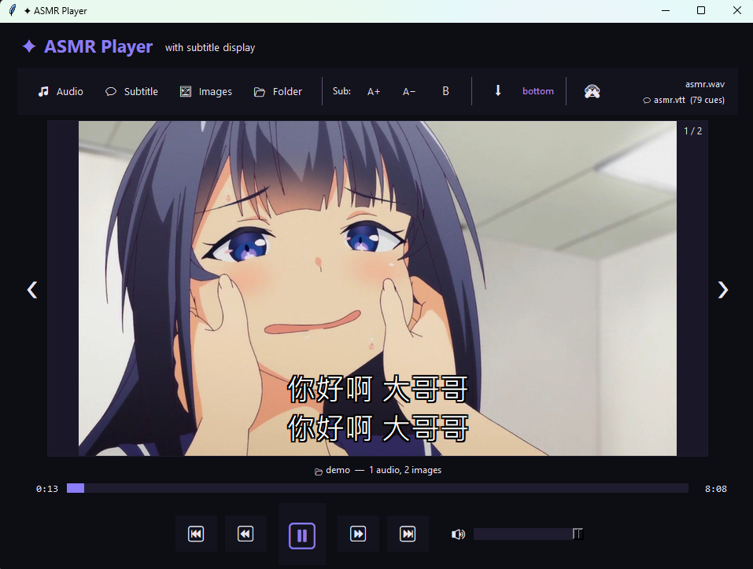

# ✦ ASMR Player with Subtitle Display



A portable ASMR audio player with real-time subtitle display, image gallery, and keyboard controls.

Designed for ASMR recordings, guided meditation, audiobooks, voice content, or any audio where you want synchronized text and visual content displayed together.

Features:

* 🎵 Audio playback with auto-play on load
* 💬 Real-time SRT / VTT / TXT subtitle display with font size, bold, and position controls
* 🖼️ Built-in image gallery viewer with hide/show toggle
* 📂 Folder-based auto loading of audio, subtitles, and images
* 🎚️ Seek bar, volume control, skip controls
* ⌨️ Full keyboard shortcut support
* 🖱️ Hover tooltips on all buttons

---

## Requirements

* **Python 3.8+** — https://python.org (enable "Add Python to PATH")
* Required Python packages:

  * `pygame` — audio playback
  * `mutagen` — audio duration detection
  * `Pillow` — image gallery support

---

## Quick Start

### Windows

Double-click:

```
Launch ASMR Player.bat
```

The launcher installs required dependencies and starts the player automatically.

### Manual

Install dependencies:

```
pip install pygame mutagen Pillow
```

Run:

```
python asmr_player.py
```

---

# Supported Formats

## Audio

| Format | Extension |
| ------ | --------- |
| MP3    | `.mp3`    |
| WAV    | `.wav`    |
| OGG    | `.ogg`    |
| FLAC   | `.flac`   |
| M4A    | `.m4a`    |
| AAC    | `.aac`    |
| OGA    | `.oga`    |

---

## Subtitles

| Format | Extension | Notes                           |
| ------ | --------- | ------------------------------- |
| SRT    | `.srt`    | Standard subtitle format        |
| WebVTT | `.vtt`    | Web subtitle format             |
| TXT    | `.txt`    | Timestamp-based subtitle format |

Example TXT format:

```
[00:00:00] Welcome, take a deep breath...
[00:00:05] Let the sound wash over you.
[00:00:12] Close your eyes slowly.
```

---

## Images / Gallery

The player supports displaying images alongside audio playback.

Supported image formats:

| Format | Extension       |
| ------ | --------------- |
| PNG    | `.png`          |
| JPEG   | `.jpg`, `.jpeg` |
| BMP    | `.bmp`          |
| GIF    | `.gif`          |
| WebP   | `.webp`         |
| TIFF   | `.tiff`         |

Images are displayed in the main viewing area and browsed using the `❮` / `❯` nav arrows on either side of the viewer. The arrows are hidden when no images or only a single image is loaded.

The current image number is displayed in the top-right corner of the viewer.

Images can be loaded manually via the **🖼 Images** toolbar button (supports multi-select). Manually loaded images are preserved when switching audio tracks. Only the **📂 Folder** feature resets the gallery.

---

# Toolbar Buttons

| Button              | Function                                          |
| ------------------- | ------------------------------------------------- |
| 🎵 Audio             | Load a single audio file                          |
| 💬 Subtitle          | Load a subtitle file manually                     |
| 🖼 Images            | Load one or more image files (multi-select)        |
| 📂 Folder            | Load all audio, images, and subtitles from a folder |
| A+                  | Increase subtitle font size                       |
| A−                  | Decrease subtitle font size                       |
| B                   | Toggle bold subtitle text                         |
| ⬇ / ◉ / ⬆           | Cycle subtitle position: bottom → center → top    |
| 🙈 / 🐵              | Hide / show the image viewer                      |

Hovering any button displays a tooltip after 0.5 seconds.

---

# Folder Auto-Load Feature

Selecting a folder via **📂 Folder** automatically scans the directory and loads:

* Audio files → added to the playlist, auto-plays immediately
* Image files → loaded into the image gallery
* Subtitle files → matched automatically when each track starts playing

Example folder:

```
ASMR Session/
│
├── 01_Relaxing_ASMR.wav
├── 01_Relaxing_ASMR.srt
│
├── 02_Soft_Whispers.mp3
├── 02_Soft_Whispers.vtt
│
├── cover.png
├── scene_01.jpg
└── scene_02.jpg
```

After selecting this folder:

* Audio files become the playback playlist and start playing automatically
* Images become the visual gallery
* Matching subtitles are loaded automatically when each track starts

---

# Subtitle Auto-Load Rules

When an audio file is loaded, the player searches the same folder for matching subtitle files.

Supported matching examples:

```
my_audio.mp3
my_audio.srt
```

or:

```
my_audio.wav
my_audio.wav.vtt
```

The player also supports subtitle files where the filename starts with the audio filename, useful for files containing extra naming characters.

Example:

```
01_Prologue.wav
01_Prologue - English Subtitle.txt
```

---

# Controls

## Mouse

| Control              | Action                             |
| -------------------- | ---------------------------------- |
| ▶ / ⏸                | Play / Pause                       |
| ⏮ / ⏭               | Previous / Next audio track        |
| ⏪ / ⏩               | Skip backward / forward 10 seconds |
| Progress bar         | Click or drag to seek              |
| Volume slider        | Adjust playback volume             |
| A+ / A−              | Increase / decrease subtitle size  |
| B                    | Toggle bold subtitles              |
| ⬇ / ◉ / ⬆ button    | Cycle subtitle position            |
| 🙈 / 🐵 button        | Hide / show image viewer           |
| ❮ / ❯                | Browse image gallery               |

## Keyboard Shortcuts

| Key                  | Action                    |
| -------------------- | ------------------------- |
| `Space`              | Play / Pause              |
| `←`                  | Rewind 10 seconds         |
| `→`                  | Fast-forward 10 seconds   |
| `↑`                  | Volume up 5%              |
| `↓`                  | Volume down 5%            |
| `+` / `=` / Numpad `+` | Next track              |
| `-` / Numpad `-`     | Previous track            |

---

# Subtitle Display

* Default font size: **28pt**
* Font size range: 8pt – 48pt (adjustable with A+ / A−)
* Subtitle text wraps automatically to fit the canvas width
* Text position is clamped inside the canvas — subtitles are never cut off regardless of font size or text length
* Subtitles render over images with an 8-directional text shadow for readability on any background
* Three position modes: **bottom** (default), **center**, **top**

---

# Portable Usage

Copy the entire project folder to another Windows machine.

Requirements:

* Python installed
* Run `Launch ASMR Player.bat`

No additional installation is required beyond Python itself.

---

# Project Structure

```
ASMR Player/
│
├── asmr_player.py
├── requirements.txt
├── Launch ASMR Player.bat
└── README.md
```

Place your ASMR audio folders anywhere. The player discovers related audio, subtitle, and image files when you select a folder.